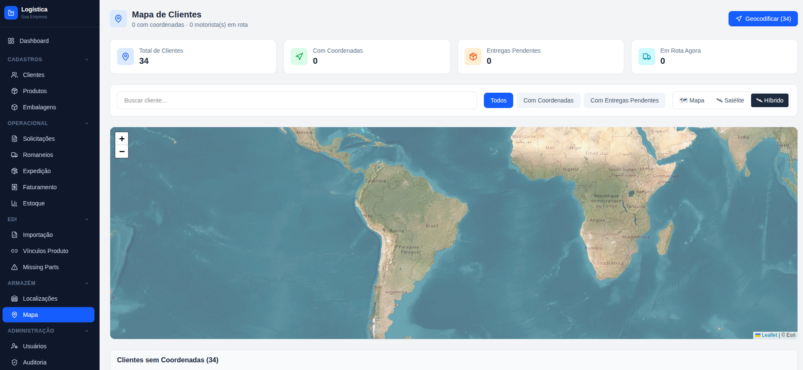

# LogiMaster


Sistema completo de gestão logística com frontend web, API REST e aplicativo mobile. Cobre o fluxo de expedição do início ao fim: desde a entrada de pedidos via EDI até a entrega ao cliente, com rastreamento em tempo real, geração de etiquetas, romaneios, faturamento e controle de armazém.




---

## Arquitetura

```
logimaster/
├── LogiMaster.API/            # ASP.NET Core Web API (.NET 8)
├── LogiMaster.Application/    # Casos de uso, serviços, DTOs
├── LogiMaster.Domain/         # Entidades, enums, interfaces
├── LogiMaster.Infrastructure/ # EF Core, repositórios, serviços externos
├── logimaster-web/            # Frontend Next.js (React + TypeScript + Tailwind)
└── logimaster-mobile/         # App Expo (React Native + TypeScript)
```

A API segue Clean Architecture com separação em camadas Domain → Application → Infrastructure → API. Autenticação via JWT com permissões granulares por módulo usando bitmask.

---

## Módulos

- **Romaneios / Expedição** — criação e acompanhamento de romaneios com fluxo de status (Pendente → Separação → Conferência → Faturado → Em Rota → Entregue)
- **Faturamento** — solicitações de faturamento vinculadas a clientes e romaneios
- **EDI** — processamento automático de arquivos EDIFACT (DELFOR, DELJIT, RND) com watcher de pasta
- **Mapa** — visualização geográfica de clientes com geocodificação de endereços e rastreamento de motoristas em tempo real via SignalR
- **Etiquetas** — geração de etiquetas de separação vinculadas ao conferente do romaneio
- **Estoque / Armazém** — controle de localizações, ruas, movimentações e inventário
- **Clientes / Produtos** — cadastro com vínculos de embalagem por cliente
- **Importação** — planilhas Excel e arquivos EDI para carga em massa de dados
- **Usuários e Auditoria** — permissões granulares por módulo (bitmask), log de auditoria
- **E-mail** — envio e leitura de e-mails com suporte a EDI via inbox

---

## Stack

**API**
- .NET 8 / ASP.NET Core Web API
- Entity Framework Core 8 + Npgsql (PostgreSQL)
- JWT Bearer Authentication
- SignalR (rastreamento em tempo real)
- iText7 (geração de PDF)
- EPPlus (leitura de planilhas Excel)
- Swagger / OpenAPI

**Web**
- Next.js 16 / React 19 / TypeScript 5
- Tailwind CSS 4
- React Leaflet + OpenStreetMap
- SignalR client (@microsoft/signalr)
- JsBarcode

**Mobile**
- Expo 54 / React Native 0.81 / TypeScript 5
- Expo Location (rastreamento GPS do motorista)
- Expo Camera + Barcode Scanner
- AsyncStorage
- React Navigation (Native Stack)

---

## Pré-requisitos

- [.NET 8 SDK](https://dotnet.microsoft.com/download)
- [Node.js 20+](https://nodejs.org)
- [PostgreSQL 14+](https://www.postgresql.org)
- [Expo CLI](https://docs.expo.dev/get-started/installation/)

---

## Como rodar

### 1. Banco de dados

Crie um banco PostgreSQL. As migrations são aplicadas automaticamente na primeira execução em modo Development.

### 2. API

```bash
cd LogiMaster.API
```

Edite `appsettings.json`:

```json
{
  "ConnectionStrings": {
    "DefaultConnection": "Host=localhost;Port=5432;Database=logimaster;Username=postgres;Password=sua_senha"
  },
  "Jwt": {
    "Secret": "SuaChaveSecretaAqui",
    "Issuer": "LogiMaster",
    "Audience": "LogiMaster"
  }
}
```

```bash
dotnet run
# API disponível em http://localhost:5000
# Swagger em http://localhost:5000/swagger
```

### 3. Frontend Web

```bash
cd logimaster-web
npm install
```

Crie `.env.local`:

```env
NEXT_PUBLIC_API_URL=http://localhost:5000
```

```bash
npm run dev
# Acesse http://localhost:3000
```

### 4. App Mobile

```bash
cd logimaster-mobile
npm install
```

Crie `.env` (use o IP da máquina na rede local, não `localhost`):

```env
EXPO_PUBLIC_API_URL=http://SEU_IP_LOCAL:5000
```

```bash
npx expo start
```

Escaneie o QR code com o app Expo Go ou use um emulador.

---

## Configuração do EDI

O módulo EDI monitora uma pasta local a cada 30 segundos. Configure em `appsettings.json`:

```json
{
  "EdiFileWatcher": {
    "Enabled": true,
    "WatchFolder": "C:\\EDI\\Entrada",
    "ProcessedFolder": "C:\\EDI\\Processados",
    "ErrorFolder": "C:\\EDI\\Erros",
    "PollingIntervalSeconds": 30
  }
}
```

Estrutura de pastas:

```
EDI/
├── Entrada/      # Arquivos EDIFACT novos são depositados aqui
├── Processados/  # Movidos após processamento bem-sucedido
└── Erros/        # Movidos em caso de falha no processamento
```

Formatos suportados: DELFOR, DELJIT, RND.

---

## Configuração de E-mail

```json
{
  "EmailSettings": {
    "SmtpHost": "smtp.seuservidor.com",
    "SmtpPort": 587,
    "SmtpUser": "email@suaempresa.com",
    "SmtpPassword": "sua_senha",
    "Pop3Host": "pop3.seuservidor.com",
    "Pop3Port": 995,
    "Pop3User": "email@suaempresa.com",
    "Pop3Password": "sua_senha"
  }
}
```

---

## Licença

Projeto de portfólio. Uso livre para estudo e referência.
