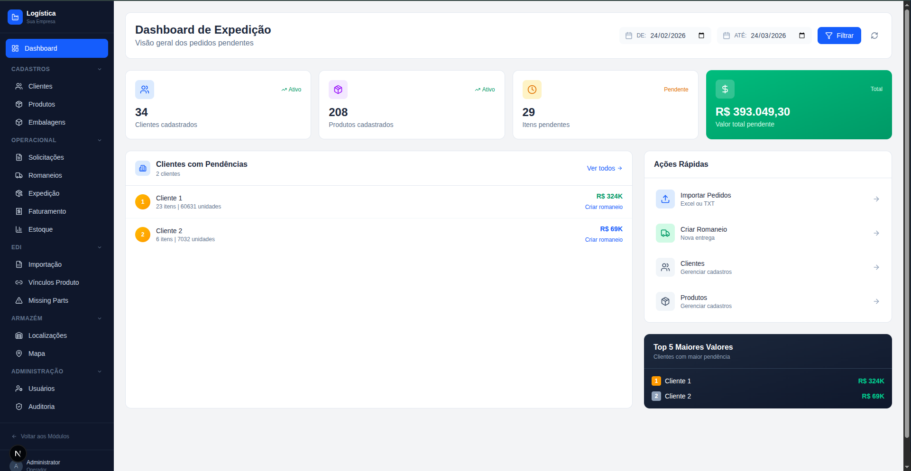

# LogiMaster Web


Painel web do LogiMaster. Interface de gestão logística completa com dashboard de KPIs, controle de romaneios, faturamento, EDI, mapa de clientes, armazém e administração de usuários.



---

## Stack

- Next.js 16 (App Router)
- React 19 / TypeScript 5
- Tailwind CSS 4
- React Leaflet + OpenStreetMap (mapa)
- @microsoft/signalr (atualizações em tempo real)
- JsBarcode (geração de etiquetas)
- Lucide React (ícones)

---

## Instalação e execução

```bash
npm install
```

Crie `.env.local` na raiz do projeto:

```env
NEXT_PUBLIC_API_URL=http://localhost:5000
```

```bash
npm run dev
# Acesse http://localhost:3000
```

Para build de produção:

```bash
npm run build
npm start
```

---

## Variáveis de ambiente

| Variável | Descrição | Exemplo |
|---|---|---|
| `NEXT_PUBLIC_API_URL` | URL base da API | `http://localhost:5000` |

---

## Telas e funcionalidades

### Login
- Autenticação com e-mail e senha
- Token JWT armazenado em localStorage
- Redirecionamento automático conforme role do usuário

### Dashboard (`/logistica`)
- KPIs: total de clientes, produtos, itens pendentes e valor total
- Cards exibidos condicionalmente por permissão do usuário

### Romaneios (`/logistica/expedicao`)
- Lista de romaneios com status em tempo real (SignalR)
- Fluxo completo: Pendente → Separação → Conferência → Faturado → Em Rota → Entregue
- Detalhamento por item com controle de conferência

### Etiquetas (`/logistica/expedicao/etiquetas`)
- Fila de etiquetas pendentes por conferente
- Geração manual de etiquetas com código de barras
- Marcação de etiquetas impressas

### EDI (`/logistica/edi`)
- Upload e processamento manual de arquivos EDIFACT
- Histórico de arquivos processados
- Gestão de clientes EDI e conversões
- Vínculos produto/cliente para mapeamento automático

### Faturamento (`/logistica/faturamento`)
- Solicitações de faturamento por cliente
- Resumo de packing lists com pendências

### Mapa (`/logistica/map`)
- Visualização geográfica dos clientes (OpenStreetMap)
- Modos: Mapa, Satélite, Híbrido
- Geocodificação de endereços (individual e em massa)
- Marcadores de motoristas em rota em tempo real (SignalR)

### Estoque / Armazém (`/logistica/estoque`, `/logistica/warehouse`)
- Posição de estoque por produto
- Movimentações de entrada e saída
- Mapa visual do armazém com ruas e localizações

### Clientes (`/logistica/clientes`)
- Cadastro completo de clientes
- Vínculos de embalagem por cliente/produto

### Produtos (`/logistica/produtos`)
- Cadastro de produtos e embalagens
- Importação via Excel (catálogo, master, planilha genérica)

### Usuários (`/logistica/usuarios`)
- Gestão de usuários e roles
- Modal de permissões com matriz por módulo (bitmask)
- Roles disponíveis: Administrator, Shipping, LogisticsAnalyst, Invoicing, Driver, Viewer

### Auditoria (`/logistica/auditoria`)
- Log de todas as ações com filtros por usuário, data e tipo

---

## Sistema de permissões

O frontend decodifica o JWT no localStorage para extrair o bitmask de permissões. A sidebar filtra os itens de menu conforme os bits ativos do usuário. O role `Administrator` tem acesso irrestrito.

```ts
const payload = JSON.parse(atob(token.split(".")[1]));
const permBits = parseInt(payload["permissions"] ?? "0", 10);
```
